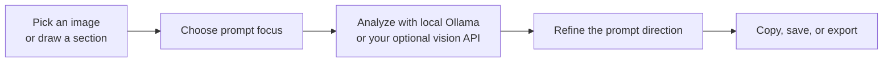
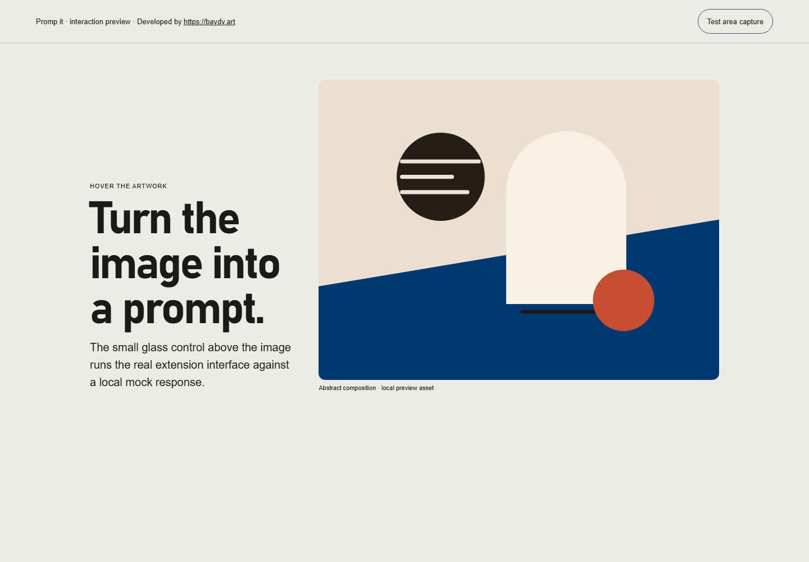

<!-- Hallmark · pre-emit critique: P5 H5 E5 S5 R5 V5 · macrostructure: Narrative Workflow · genre: atmospheric · theme: existing graphite / cyan liquid-glass identity -->

<p align="center">
  
</p>

<h1 align="center">Promp it</h1>

<p align="center">
  <strong>Describe any image in one click. Get a complete generation prompt.</strong>
</p>

<p align="center">
  A privacy-first browser extension that reads a full image or a selected section with Ollama—or an optional OpenAI-compatible vision endpoint—and turns verified visual evidence into a precise prompt for image generation.
</p>

<p align="center">
  <a href="#install"><strong>Install from source</strong></a> ·
  <a href="#choose-a-runtime"><strong>Choose a vision runtime</strong></a> ·
  <a href="#publish-and-release"><strong>Publish or release</strong></a>
</p>

<p align="center">
  <a href="https://github.com/baydy-art/Promp_it/releases"></a>
  <a href="https://developer.chrome.com/docs/extensions/mv3/intro/"></a>
  <a href="./LICENSE"></a>
  <a href="https://www.baydy.art"></a>
</p>

---

## From image to usable prompt

Promp it is designed for artists, designers, image-model users, and moodboard builders who need more than a loose caption. It observes the image, keeps factual evidence separate from creative direction, and produces a detailed English generation prompt plus structured JSON.



| It reads | It gives you |
| --- | --- |
| Subject, pose, expression, material, environment, and visible text | A production-ready English prompt |
| Lens behavior, viewpoint, perspective, crop, depth, and composition | Structured JSON for integrations and inspection |
| Light direction, shadow quality, palette, style, mood, and finish | Optional negative prompt and platform-aware formatting |

## Product preview

<p align="center">
  
</p>

<p align="center"><sub>Local development preview of the shipped interaction surface. It uses a local mock response—no image is sent to a cloud service for this preview.</sub></p>

## What makes a prompt more exact

### Focus the evidence before analysis

Choose **All details**, **Subject**, **Pose**, **Camera**, **Angle**, **Composition**, **Lighting**, **Style & color**, or **Background**. The result is tailored to the selected evidence instead of padding every prompt with unrelated details.

For a dense image, choose **Select section** and drag over the evidence you want to describe. The animated dot-grid appears over the selected browser image only after the capture is made, so the overlay is never added to the image sent to the model.

### Finish the generation language after analysis

- Target **Generic**, Flux, Qwen, ChatGPT, Nano Banana, or other available output formats.
- Set a **0–100 prompt refinement** level: source-locked at the low end; restrained modern art direction in the middle; a stronger coherent interpretation at the high end.
- Turn on **Refine prompt** for a second, text-only local pass that improves camera geometry, light behavior, composition, materials, and finish without changing verified facts.
- Roll the dice for one tailored contemporary direction; it avoids random style-tag piles and keeps the subject, pose, crop, light logic, and scene evidence intact.
- Remove image text with **Visuals only**, include a negative prompt when useful, or replace the background with a controlled solid or studio preset.
- Enable **Local learning memory** to retain only generalized preferences from prompts you actually copy. It is not model training and never changes model weights.

## Choose a runtime

Promp it defaults to local Ollama. No account, API key, or hosted model is required for that path.

| Runtime | When to use it | Where pixels go |
| --- | --- | --- |
| **Ollama — local only** | The private default; works with installed local vision models | Your configured local Ollama server, normally `http://127.0.0.1:11434` |
| **Vision API — external** | You deliberately prefer an OpenAI-compatible vision service | Only the endpoint you configure |
| **Automatic — Ollama then API** | You want local-first behavior with an explicit external fallback | Local first; external only when local analysis is unavailable |

> [!IMPORTANT]
> The external runtime is opt-in. Its API key is stored in `chrome.storage.local`. Promp it sends pixels to an external endpoint only when you select that runtime or enable automatic fallback.

### Local model guide

The extension detects models installed in Ollama from `/api/tags`. Labels are helpful hints rather than a guarantee that a model accepts images—use **Test vision runtime** before your first analysis.

| Approx. available memory | Suggested model | Best for |
| --- | --- | --- |
| 6 GB | `qwen3.5:4b` | Compact local image reading with reduced image and context budgets |
| 12 GB | `qwen3.5:9b` | A balanced accuracy / speed setup |
| 24 GB | `qwen3.6:27b` | Maximum local prompt fidelity for camera geometry and lighting |

Memory figures are practical targets, not hard requirements. Quantization, GPU architecture, CPU offload, context size, and other running applications affect actual usage.

```powershell
ollama pull qwen3.5:4b
ollama pull qwen3.5:9b
ollama pull qwen3.6:27b
```

You need only one compatible vision model. In Promp it settings, choose **Detect installed models**, select the model, then run **Test vision runtime**.

## Install

### Brave or Chrome

1. Download or clone this repository.
2. Open `brave://extensions` or `chrome://extensions`.
3. Enable **Developer mode**.
4. Select **Load unpacked**, then choose the repository folder.
5. Reload the extension card and any already-open web pages.

Promp it cannot run on browser-internal pages, extension stores, or some protected document viewers. Test first on a normal `http://` or `https://` page.

### Other browser targets

The `release/stores/` build artifacts are prepared separately for Firefox, Edge, and Safari packaging. See [publishing guidance](./PUBLISHING.md) and the [store submission kit](./store/STORE_SUBMISSION.md) for the exact upload and review requirements.

## How to use it

1. Hover a web image and choose **Prompt image**, or right-click an image and choose Promp it from the browser menu.
2. Pick the visual evidence that matters—or leave **All details** selected.
3. Optionally enable **Select section**, then draw the exact part of the image to analyze.
4. Choose the platform, visuals-only / negative-prompt options, and refinement strength.
5. Start the analysis. Promp it records generation time and explains local or provider failures in plain language.
6. Finish with **Refine prompt**, the random modern-direction dice, or the background editor.
7. Copy the English prompt, inspect JSON, or reopen the saved item from local history.

History is stored locally. **Export history** creates one ZIP containing the source image, prompt text, and structured data for each saved item.

## Privacy and data handling

- Local Ollama remains the default vision runtime.
- Your history, remembered setup, API configuration, and preference memory are held in extension-local storage.
- No telemetry, analytics, or image uploads are required for the local-only flow.
- Selecting an external vision provider changes that boundary; inspect the provider before sending it sensitive imagery.

Read the complete [privacy policy](./store/PRIVACY_POLICY.md) and [review notes](./store/REVIEW_NOTES.md) before store submission.

## Troubleshooting

<details>
<summary><strong>“Failed to fetch” or “Ollama returned 403 Forbidden”</strong></summary>

Confirm Ollama is running and that the configured URL is reachable from the extension. Start with the default `http://127.0.0.1:11434`, click **Detect installed models**, select a compatible vision model, and run **Test vision runtime**. If you use a proxy or custom server URL, check its CORS and authorization rules.
</details>

<details>
<summary><strong>“The model response was not valid JSON”</strong></summary>

Try again with fewer custom instructions, a larger context window, or another installed vision model. Promp it performs an automatic local repair, but a vision model must still return a complete structured answer.
</details>

<details>
<summary><strong>The prompt is vague or visually inaccurate</strong></summary>

Choose a narrow focus such as **Camera**, **Angle**, or **Lighting**; use **Select section** for a busy image; lower refinement to preserve source facts; and use **Refine prompt** only after the factual reading is sound. A stronger model or larger context budget can improve fine-grained geometry and lighting analysis.
</details>

<details>
<summary><strong>The image action does not appear</strong></summary>

Reload the web page after loading or updating the extension. The image action is intentionally disabled on protected browser surfaces. Try an ordinary public web page with a standard image element.
</details>

## Develop locally

```powershell
npm test
npm run lint
npm run build
```

`npm test` runs the local smoke suite. `npm run lint` checks JavaScript syntax. `npm run build` creates the browser-store packages; it does not publish them.

### Repository map

```text
background.js                  extension service worker and provider orchestration
content.js / content.css       image controls, analysis surface, history, and capture UX
options.*                      settings and runtime configuration
tokens.css                     shared visual tokens
icons/                         browser action and package icons
assets/README/                 README-only, truthful project visuals
scripts/                       store-package builder
store/                         listing copy, privacy policy, review, and submission guides
tests/                         smoke and optional live-Ollama checks
```

For contribution, security, and conduct guidance, see [CONTRIBUTING.md](./CONTRIBUTING.md), [SECURITY.md](./SECURITY.md), and [CODE_OF_CONDUCT.md](./CODE_OF_CONDUCT.md). Released changes are summarized in [CHANGELOG.md](./CHANGELOG.md).

## Publish and release

For a GitHub release, attach the source archive and the generic extension archive from `release/`. Upload store-specific packages directly to their corresponding stores—not to the repository source tree. The browser-specific signing and listing workflow lives in [PUBLISHING.md](./PUBLISHING.md) and [`store/`](./store/).

## Connect & community

<p align="center">
  <a href="https://www.baydy.art">Website</a> &nbsp;•&nbsp;
  <a href="https://www.linkedin.com/in/ayoubbaydy/">LinkedIn — Ayoub Baydy</a>
  <br><br>
  Designed &amp; developed by <a href="https://www.baydy.art"><strong>Baydy Art</strong></a>
  <br>
  <a href="https://www.baydy.art"></a>
</p>
